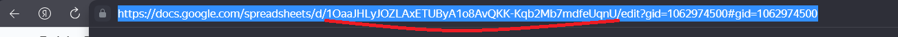
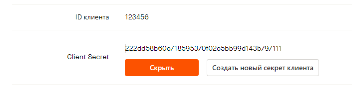

# TrainingBot

## Описание проекта

TrainingBot - это бот для тренеров и спортсменов в области легкой атлетики. Этот бот, созданный на Python и интегрированный с Telegram, позволяет спортсменам легко регистрироваться, вводить и отправлять данные о своем самочувствии и тренировках, а также автоматически синхронизировать данные о тренировках через сайт Strava. Для удобства хранения и анализа данных используется Google Sheets, где каждому спортсмену автоматически создается именной лист. Тренеры могут назначать задачи и просматривать данные о самочувствии и результаты тренировок своих подопечных, что делает процесс тренировки более организованным и эффективным.

### Основные функции:

- **Регистрация спортсменов** с созданием именного листа в Google Sheets.
- **Отправка данных о самочувствии** утром (оценка самочувствия, пульс, количество часов сна).
- **Отправка данных после тренировки** (дистанция, средний темп, средний пульс).
- **Автоматическая синхронизация данных тренировок** через сайт Strava.
- **Возможность тренера назначать задачи** на день или на неделю через интерфейс бота.

### Технологический стек:

- Python 3.11
- Python Telegram Bot 13.7
- Django 4.2
- django-social-auth
- Google API Python Client 
- PostgreSQL 13.10
- Docker 
- Docker Compose v1+

### Инструкция по развертыванию
1. Установить и запустить Docker 
2. Установить все переменные окружения в .env на примере [.env.example](.env.example) !!! Все переменные обязательны !!!
   1. По инструкции из файла [Google_Cloud_Platform_API_и_сервисный_аккаунт.html](instructions%2FGoogle_Cloud_Platform_API_%D0%B8_%D1%81%D0%B5%D1%80%D0%B2%D0%B8%D1%81%D0%BD%D1%8B%D0%B9_%D0%B0%D0%BA%D0%BA%D0%B0%D1%83%D0%BD%D1%82.html) получить учетные данные для Google Sheets и заполнить соответствующие переменные.
   2. Заполнить данные для БД
   3. Создать бота через https://t.me/BotFather
   4. Установить API Token бота в переменную BOT_TOKEN
   5. Установить telegram id тренера в переменную TRAINER_ID (можно узнать тут https://t.me/userinfobot)
   6. Создать лист в Google Sheets с того же аккаунта с которого были созданы учетные данные в пункте 1.1
   7. Скопировать из адресной строки SPREADSHEET_ID в одноимённую переменную
   8. Перейти на https://www.strava.com/. Войти через Google. Перейти на https://www.strava.com/settings/api. Заполнить нужные данные и указать в "Домен для запросов приложения" домен или ip адрес сервера, либо localhost при локальном развертывании. 
   9. Скопировать значение ID клиента в SOCIAL_AUTH_STRAVA_KEY и Client Secret в SOCIAL_AUTH_STRAVA_SECRET 
2. Запустить контейнеры командой `docker compose up -d --build` либо `docker compose -f docker-compose.prod.yml up -d --build` если развертывание на сервере.
3. Теперь можно пользоваться ботом !